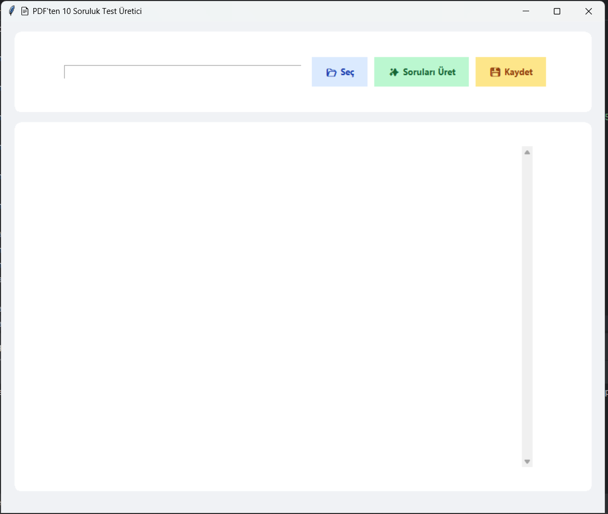
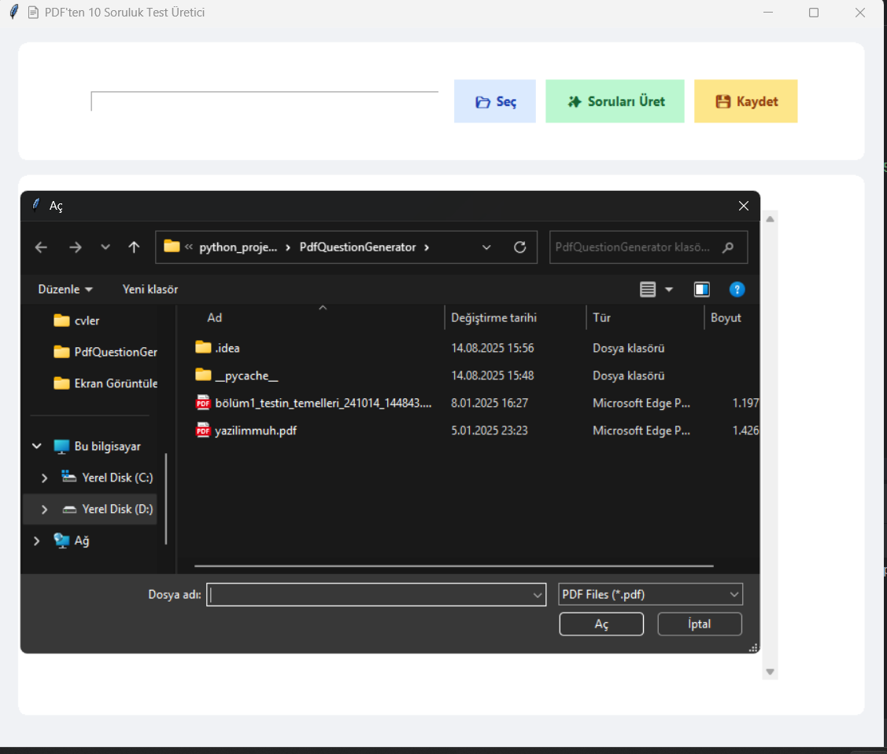
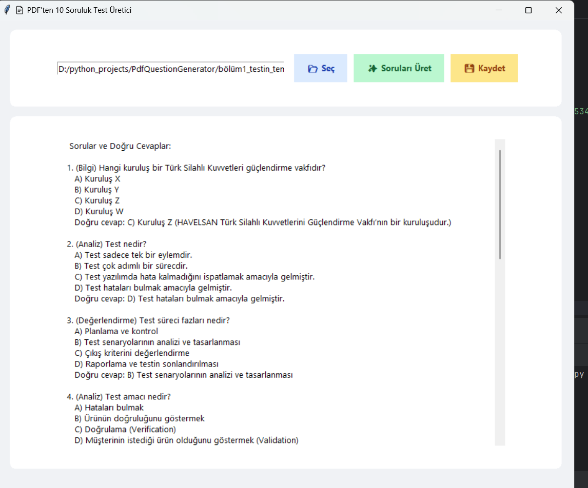
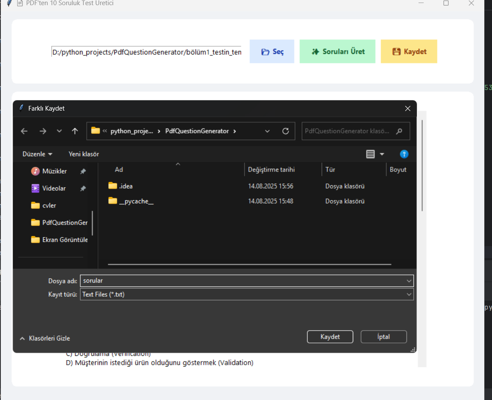

# PDF Soru Üretici

Bu proje, verilen bir PDF dosyasındaki metinleri okuyarak **yapay zekâ destekli sorular** üretir.  
Arayüz **Tkinter** ile geliştirilmiş, PDF işlemleri için **PyMuPDF (fitz)** kütüphanesi kullanılmış ve soru üretimi için **Ollama** üzerinden **Mistral** modeli entegre edilmiştir.  

---

## 🚀 Özellikler
- 📂 PDF dosyasını seçme  
- 📖 Seçilen PDF’ten metin okuma  
- ❓ Yapay zekâ ile sorular üretme  
- 🖥️ Basit ve kullanıcı dostu arayüz (Tkinter)  
- 📌 Card tasarımlı butonlar ve soru gösterimi  

---

## 🛠️ Kullanılan Teknolojiler
- [Python](https://www.python.org/)  
- [Tkinter](https://docs.python.org/3/library/tkinter.html) → Arayüz geliştirme  
- [PyMuPDF (fitz)](https://pymupdf.readthedocs.io/) → PDF okuma  
- [Ollama](https://ollama.com/) + [Mistral](https://mistral.ai/) → Yapay zekâ ile soru üretimi  

---

## 📷 Ekran Görüntüleri  

Uygulamadan bazı örnek ekran görüntüleri:  

  
  
  
  

---

## ⚙️ Kurulum
Projeyi çalıştırmadan önce gerekli kütüphaneleri yükleyin:

```bash
pip install pymupdf
